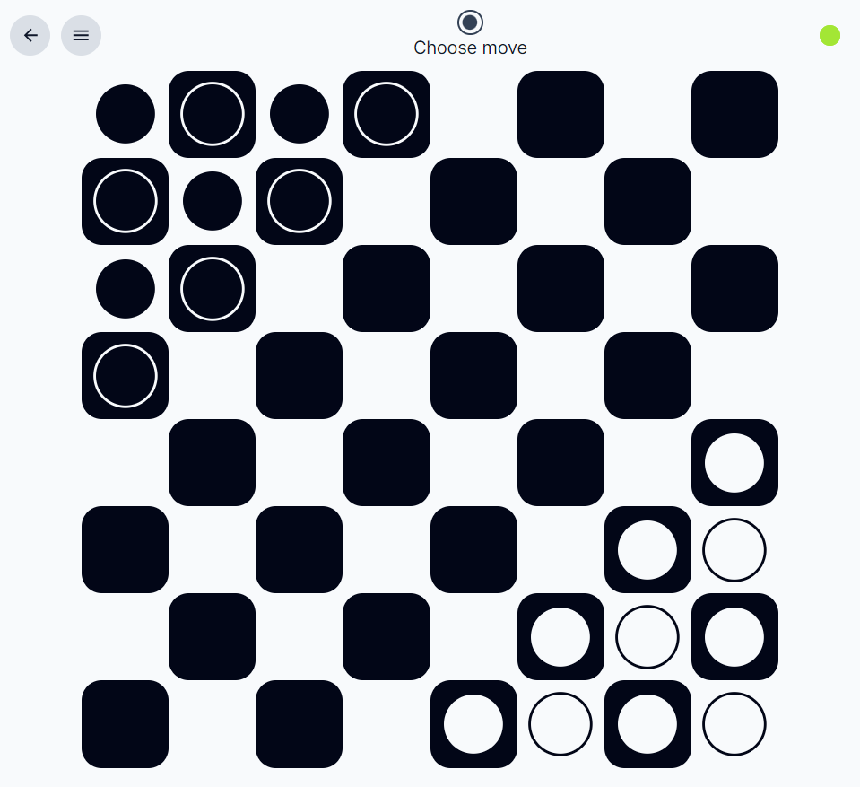

# mess

Make your own rules for a chess-like game in a dedicated Domain Specific
Language and play it with others.





## Usage

### Run locally with Docker Compose

Build all containers with:

```sh
docker-compose build
```

Start all containers with:

```sh
docker-compose up
```

Service gateway will be available at `http://localhost:5000/`.

### Deploy to a Kubernetes cluster

1. Setup Kubernetes cluster and acquire credentials.
2. Configure server address in `k8s.yaml`.
3. `kubectl apply -f ./k8s.yaml`.

## System parts

* [Backend](./be)
* [Frontend](./fe)

## Credits

* [Chess pieces from example rules by Cburnett and others (modified by me)](https://commons.wikimedia.org/wiki/Category:SVG_chess_pieces),
* [Dōbutsu shōgi pieces from example rules by cezantyl (modified by me)](https://www.thingiverse.com/thing:4712722),
